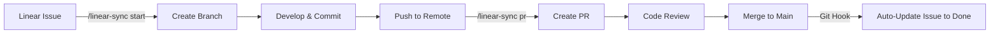

# Linear-Git Workflow Synchronization

## Purpose

Automate the bidirectional workflow between Linear issues and Git development:
- **Start work**: Create branch from Linear issue, update status to "In Progress"
- **Create PR**: Link PR to Linear issue, update status to "In Review"
- **Complete work**: Mark issue as "Done" when merged
- **Check status**: View current issue status and related PRs

## When to Use

- Starting work on a Linear issue
- Creating a PR for an issue
- Checking issue status during development
- Maintaining traceability from issue → code → deployment

## Commands

### `/linear-sync start <issue-id>`

Start work on a Linear issue. Creates properly named branch and updates Linear.

**Example:**
```bash
/linear-sync start RUN-123
```

**What it does:**
1. Fetches issue details from Linear
2. Creates git branch: `feature/RUN-123-issue-title` (or `fix/RUN-123-...` for bugs)
3. Checks out the new branch
4. Updates Linear issue:
   - Status: "In Progress"
   - Assignee: Current user (if unassigned)
   - Comment: "Started work on branch: feature/RUN-123-..."
5. Displays issue summary and next steps

**Issue Types → Branch Prefixes:**
- Bug → `fix/RUN-123-description`
- Feature → `feature/RUN-123-description`
- Improvement → `feat/RUN-123-description`
- Chore → `chore/RUN-123-description`
- Default → `feature/RUN-123-description`

### `/linear-sync pr`

Create a PR/MR linked to the Linear issue from current branch.

**Example:**
```bash
/linear-sync pr
```

**What it does:**
1. Detects current git branch
2. Extracts Linear issue ID from branch name (e.g., `RUN-123`)
3. Fetches issue details from Linear
4. Creates PR/MR with:
   - Title: `[RUN-123] Original issue title`
   - Description:
     ```markdown
     ## Linear Issue
     [RUN-123: Issue Title](https://linear.app/...)

     ## Summary
     [Original issue description]

     ## Changes
     - [Auto-generated from commits or manual input]

     ## Test Plan
     - [ ] Tests pass locally
     - [ ] Manual testing completed
     ```
   - Labels: Matches Linear issue labels
5. Updates Linear issue:
   - Status: "In Review"
   - Comment: "PR created: [link]"
   - Adds PR URL to issue
6. Displays PR link and review instructions

**Requirements:**
- Current branch must contain Linear issue ID (e.g., `feature/RUN-123-...`)
- Branch must be pushed to remote
- GitLab or GitHub access configured

### `/linear-sync status`

Check current Linear issue status and related PRs.

**Example:**
```bash
/linear-sync status
```

**What it does:**
1. Detects current branch or asks for issue ID
2. Fetches issue details from Linear
3. Displays:
   - Issue title, status, assignee, priority
   - Related PRs/MRs
   - Recent comments
   - Blockers or dependencies
   - Next actions

### `/linear-sync complete`

Manually mark issue as complete (usually automated via git hook).

**Example:**
```bash
/linear-sync complete RUN-123
```

**What it does:**
1. Updates Linear issue:
   - Status: "Done" or "Completed"
   - Comment: "Work completed manually"
   - Sets completion date
2. Displays completion summary

**Note:** Usually triggered automatically by post-merge git hook. Use this for manual completion.

## Workflow Integration

### Full Development Cycle



### Example Session

```bash
# 1. Start work on issue
$ /linear-sync start RUN-123

✅ Issue found: Add vibe tag filtering to Flow
📝 Type: Feature
👤 Assignee: You
🎯 Status: Backlog → In Progress

Created branch: feature/RUN-123-add-vibe-tag-filtering
Checked out: feature/RUN-123-add-vibe-tag-filtering

Next steps:
1. Implement the feature
2. Commit with: feat(flow): Add vibe tag filtering for RUN-123
3. Push: git push -u origin feature/RUN-123-add-vibe-tag-filtering
4. Create PR: /linear-sync pr

# 2. Develop...
$ git add .
$ git commit -m "feat(flow): Add vibe tag filtering for RUN-123"
$ git push -u origin feature/RUN-123-add-vibe-tag-filtering

# 3. Create PR
$ /linear-sync pr

✅ PR created: https://gitlab.com/brock-run/runexpression/-/merge_requests/42
📋 Title: [RUN-123] Add vibe tag filtering to Flow
🔗 Linked to Linear issue
📝 Issue status: In Progress → In Review

Next steps:
1. Request review from team
2. Address feedback
3. Merge when approved (auto-updates Linear to Done)

# 4. Check status during review
$ /linear-sync status

📋 Issue: RUN-123 - Add vibe tag filtering to Flow
🎯 Status: In Review
👤 Assignee: You
⭐ Priority: High
🔗 PR: https://gitlab.com/brock-run/runexpression/-/merge_requests/42 (Open)

Recent activity:
- 2h ago: PR created
- 3h ago: Status changed to In Review
- 5h ago: Started work on branch

Next action: Wait for review approval
```

## MCP Tools Used

This skill leverages these MCP tools:

### Linear MCP (`mcp__plugin_linear_linear__*`)

```typescript
// Get issue details
mcp__plugin_linear_linear__get_issue({
  id: "issue-id-or-identifier"  // e.g., "RUN-123"
})

// Update issue status
mcp__plugin_linear_linear__update_issue({
  id: "issue-uuid",
  state: "In Progress"  // or "In Review", "Done"
})

// Add comment to issue
mcp__plugin_linear_linear__create_comment({
  issueId: "issue-uuid",
  body: "Started work on branch: feature/RUN-123-..."
})

// Get current user
mcp__plugin_linear_linear__get_user({
  query: "me"
})
```

### GitLab MCP (`mcp__plugin_gitlab_gitlab__*`)

```typescript
// Create merge request
mcp__plugin_gitlab_gitlab__create_merge_request({
  id: "brock-run/runexpression",
  source_branch: "feature/RUN-123-add-vibe-tags",
  target_branch: "main",
  title: "[RUN-123] Add vibe tag filtering",
  description: "..."
})

// Get current branch MRs
mcp__plugin_gitlab_gitlab__search({
  scope: "merge_requests",
  search: "RUN-123"
})
```

## Implementation Details

### Branch Name Generation

```typescript
function generateBranchName(issueId: string, issueTitle: string, issueType: string): string {
  // Determine prefix based on issue type
  const prefix = {
    'bug': 'fix',
    'feature': 'feature',
    'improvement': 'feat',
    'chore': 'chore'
  }[issueType.toLowerCase()] || 'feature'

  // Slugify title: lowercase, replace spaces with hyphens, remove special chars
  const slug = issueTitle
    .toLowerCase()
    .replace(/[^a-z0-9\s-]/g, '')
    .replace(/\s+/g, '-')
    .substring(0, 50)  // Max 50 chars

  return `${prefix}/${issueId}-${slug}`
}

// Examples:
// "Add vibe tag filtering" → "feature/RUN-123-add-vibe-tag-filtering"
// "Fix auth redirect bug" → "fix/RUN-456-fix-auth-redirect-bug"
```

### Issue ID Extraction

```typescript
function extractIssueIdFromBranch(branchName: string): string | null {
  // Match pattern: feature/RUN-123-description
  const match = branchName.match(/[A-Z]+-\d+/)
  return match ? match[0] : null
}

// Examples:
// "feature/RUN-123-add-vibe-tags" → "RUN-123"
// "fix/RUN-456-auth-bug" → "RUN-456"
// "my-feature-branch" → null
```

### PR Description Template

```markdown
## Linear Issue
[{issueId}: {issueTitle}](https://linear.app/runexpression/issue/{issueId})

## Summary
{issueDescription}

## Changes
{auto-generated from git log or manual}

## Test Plan
- [ ] Unit tests pass (`npm run test`)
- [ ] Type check passes (`npm run type-check`)
- [ ] Lint passes (`npm run lint`)
- [ ] Manual testing completed
- [ ] Database migrations tested (if applicable)

## Screenshots
<!-- Add if applicable -->

## Related Issues
<!-- Link related Linear issues if any -->

---

🤖 Created with [linear-sync skill](https://github.com/brock-run/runexpression)
```

## Error Handling

### Issue Not Found

```bash
$ /linear-sync start RUN-999

❌ Error: Linear issue RUN-999 not found

Suggestions:
1. Verify issue ID format (e.g., RUN-123)
2. Check issue exists in Linear workspace
3. Verify Linear API key has correct permissions
4. Use: claude mcp list to check Linear MCP connection
```

### Branch Already Exists

```bash
$ /linear-sync start RUN-123

⚠️  Warning: Branch feature/RUN-123-add-vibe-tags already exists

Options:
1. Check out existing branch: git checkout feature/RUN-123-add-vibe-tags
2. Delete and recreate: git branch -D feature/RUN-123-add-vibe-tags
3. Use different branch name (manual)

Continue? [y/N]
```

### No Issue ID in Branch

```bash
$ /linear-sync pr

❌ Error: No Linear issue ID found in current branch name

Current branch: my-feature-branch

Suggestions:
1. Use /linear-sync start RUN-123 to create properly named branch
2. Rename branch to include issue ID: git branch -m feature/RUN-123-description
3. Provide issue ID manually: /linear-sync pr RUN-123
```

### MCP Connection Failed

```bash
$ /linear-sync start RUN-123

❌ Error: Failed to connect to Linear MCP

Troubleshooting:
1. Check Linear MCP connection: claude mcp list
2. Verify LINEAR_API_KEY environment variable
3. Reinstall Linear MCP: claude mcp remove linear && claude mcp add linear
4. Check MCP debug logs: claude --mcp-debug
```

## Git Hook Integration

### Automatic Issue Completion on Merge

Add to `.husky/post-merge` or `.git/hooks/post-merge`:

```bash
#!/bin/sh
# Auto-complete Linear issues when merged to main

BRANCH=$(git rev-parse --abbrev-ref HEAD)

if [ "$BRANCH" = "main" ] || [ "$BRANCH" = "master" ]; then
  # Extract issue ID from last commit
  ISSUE_ID=$(git log -1 --pretty=%B | grep -oE '[A-Z]+-[0-9]+' | head -1)

  if [ -n "$ISSUE_ID" ]; then
    echo "✅ Merged! Updating Linear issue $ISSUE_ID to Done..."
    claude -p "/linear-sync complete $ISSUE_ID" --headless
  fi
fi
```

## Best Practices

### 1. Always Start with Linear

```bash
# ✅ Good: Issue-driven development
/linear-sync start RUN-123
# ... develop ...
/linear-sync pr

# ❌ Bad: Create branch manually
git checkout -b my-feature
# ... develop ...
# Now hard to link to Linear
```

### 2. Include Issue ID in Commits

```bash
# ✅ Good: Reference issue in commit message
git commit -m "feat(flow): Add vibe filtering for RUN-123"

# ⚠️  OK: Reference in commit body
git commit -m "feat(flow): Add vibe filtering

Implements RUN-123: Add vibe tag filtering to Flow"

# ❌ Bad: No issue reference
git commit -m "add vibe tags"
```

### 3. Use Conventional Commits

Combine with `git-workflow-conventional-commits` skill:

```bash
feat(flow): Add vibe tag filtering for RUN-123
fix(auth): Resolve redirect loop (RUN-456)
chore(deps): Update Next.js for RUN-789
```

### 4. Keep Linear Updated

```bash
# Check status frequently
/linear-sync status

# Update manually if needed
# (Usually automated, but useful for context)
```

### 5. Link Related Issues

When creating PR, mention related issues:

```markdown
## Related Issues
- Blocks: RUN-124 (needs vibe tags implemented)
- Related: RUN-100 (Flow feature epic)
```

## Troubleshooting

### Common Issues

| Problem | Solution |
|---------|----------|
| "Issue not found" | Verify issue ID format and Linear access |
| "Branch already exists" | Check out existing branch or delete and recreate |
| "No issue ID in branch" | Use `/linear-sync start` or rename branch |
| "MCP connection failed" | Check `claude mcp list` and environment variables |
| "PR creation failed" | Verify git remote and push branch first |
| "Status update failed" | Check Linear permissions and issue state workflow |

### Debug Mode

Run with verbose output:

```bash
claude --debug -p "/linear-sync start RUN-123"
```

### Manual Fallback

If automation fails, manually:

1. Create branch: `git checkout -b feature/RUN-123-description`
2. Update Linear issue in web UI
3. Create PR manually with Linear link
4. Comment on Linear issue with PR link

## Examples

### Feature Development

```bash
# Get issue from Linear backlog
/linear-sync start RUN-200

# Develop feature
git add components/flow/vibe-tag-filter.tsx
git commit -m "feat(flow): Add vibe tag filter component for RUN-200"
git push -u origin feature/RUN-200-add-vibe-tag-filter

# Create PR
/linear-sync pr

# After merge (automatic)
# Issue auto-updated to "Done"
```

### Bug Fix

```bash
# Emergency bug fix
/linear-sync start RUN-501

# Fix bug
git add app/api/auth/callback/route.ts
git commit -m "fix(auth): Resolve infinite redirect loop (RUN-501)"
git push -u origin fix/RUN-501-resolve-infinite-redirect-loop

# Create PR
/linear-sync pr

# Fast-track review and merge
# Issue auto-updated to "Done"
```

### Chore/Maintenance

```bash
# Dependency update
/linear-sync start RUN-600

# Update dependencies
npm update
git add package.json package-lock.json
git commit -m "chore(deps): Update Next.js to 14.2.0 for RUN-600"
git push -u origin chore/RUN-600-update-nextjs

# Create PR
/linear-sync pr
```

## Integration with Other Skills

### With `git-workflow-conventional-commits`

```bash
# linear-sync creates properly named branch
/linear-sync start RUN-123

# git-workflow ensures conventional commit format
git commit -m "feat(flow): Add vibe filtering for RUN-123"
# Pre-commit hook validates format

# linear-sync creates well-formatted PR
/linear-sync pr
```

### With `db-review`

```bash
# Start database migration work
/linear-sync start RUN-300

# Create migration
# ... edit supabase/migrations/xxx_add_vibe_tags.sql ...

# db-review automatically checks migration (via hook)
# Suggests security improvements

# Create PR with review results
/linear-sync pr
```

### With `project-status`

```bash
# Check overall status
/project-status

# Shows:
# - My Linear issues (including RUN-123 in progress)
# - Open PRs (including RUN-123 PR)
# - Blockers and dependencies
```

## Configuration

### Environment Variables

Required:
```bash
LINEAR_API_KEY=lin_api_xxxxxxxxxxxx
```

Optional (for GitLab integration):
```bash
GITLAB_TOKEN=glpat-xxxxxxxxxxxx
```

### Default Settings

Can be customized in `.claude/settings.json`:

```json
{
  "skills": {
    "linear-sync": {
      "defaultBranch": "main",
      "prTemplate": "default",
      "autoAssign": true,
      "statusTransitions": {
        "start": "In Progress",
        "pr": "In Review",
        "complete": "Done"
      }
    }
  }
}
```

## FAQ

**Q: Can I use this with GitHub instead of GitLab?**
A: Yes, but you'll need to configure GitHub MCP instead. The skill will detect which MCP is available.

**Q: What if I don't have Linear access?**
A: This skill requires Linear MCP. Without it, use manual git workflow with `git-workflow-conventional-commits` skill.

**Q: Can I customize the PR template?**
A: Yes, modify the PR description template in the skill settings or provide custom template via configuration.

**Q: Does this work in Cursor IDE?**
A: Yes! Use the terminal in Cursor to run `/linear-sync` commands. Cursor can access same MCP servers.

**Q: What if branch name is too long?**
A: Branch names are truncated to 50 chars for the description part. Full issue title is preserved in PR.

**Q: Can I skip status updates?**
A: Yes, use `--no-status-update` flag: `/linear-sync start RUN-123 --no-status-update`

---

**Skill Version:** 1.0
**Last Updated:** 2026-01-23
**Maintainer:** Engineering Team
