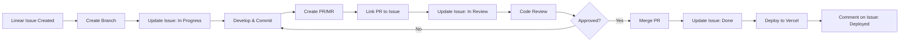

# RunExpression: MCP Integration & Workflow Automation

**Last Updated:** 2026-01-23
**Maintainer:** Engineering Team
**Status:** Implementation Guide

---

## Overview

This document defines how RunExpression leverages Model Context Protocol (MCP) servers to create seamless workflows between development tools, project management, and deployment infrastructure. By integrating Linear, Supabase, GitLab, and Greptile MCPs, we maintain bidirectional sync between code, issues, and deployments.

**Goals:**
- **Single source of truth**: Linear issues drive development, code updates Linear
- **Automated workflows**: Reduce manual context switching between tools
- **Visibility**: Real-time project status across all tools
- **Quality gates**: Automated database and security reviews

---

## 1. Available MCP Servers

### 1.1 Connected MCP Servers

| MCP Server | Status | Purpose | Key Capabilities |
|------------|--------|---------|------------------|
| **Linear** | ✓ Connected | Issue tracking & project management | List/create/update issues, comments, projects, teams |
| **Supabase** | ✓ Connected | Database operations & monitoring | Execute SQL, apply migrations, get advisors, list tables |
| **GitLab** | ✓ Connected | Source control & CI/CD | Create MRs, get commits/diffs, search code, manage pipelines |
| **Greptile** | ✓ Connected | Codebase intelligence | Search code patterns, custom context, PR reviews |
| **Context7** | ✓ Connected | Library documentation | Up-to-date docs for React, Next.js, Supabase, etc. |
| **Playwright** | ✓ Connected | Browser automation | E2E testing, visual regression, debugging |

### 1.2 MCP Server Capabilities Reference

#### Linear MCP (`mcp__plugin_linear_linear__*`)

**Issue Management:**
- `list_issues`: Query issues by assignee, status, project, team, labels
- `get_issue`: Get detailed issue info including relations and attachments
- `create_issue`: Create new issue with labels, assignee, project
- `update_issue`: Update issue status, description, relations, labels
- `create_comment`: Add comments to issues
- `list_comments`: Get all comments for an issue

**Project Management:**
- `list_projects`: Get all projects with filters
- `get_project`: Get project details
- `create_project`: Create new project
- `update_project`: Update project details

**Team & User Management:**
- `list_teams`: Get all teams
- `get_team`: Get team details
- `list_users`: Get workspace users
- `get_user`: Get user details (use "me" for current user)

**Example Usage:**
```typescript
// Get all issues assigned to me that are in progress
mcp__plugin_linear_linear__list_issues({
  assignee: "me",
  state: "In Progress"
})

// Update issue to "In Review" and add comment
mcp__plugin_linear_linear__update_issue({
  id: "issue-uuid",
  state: "In Review"
})
mcp__plugin_linear_linear__create_comment({
  issueId: "issue-uuid",
  body: "PR created: https://github.com/..."
})
```

#### Supabase MCP (`mcp__plugin_supabase_supabase__*`)

**Database Operations:**
- `list_tables`: List all tables in schema(s)
- `execute_sql`: Run SQL queries (for SELECT/data operations)
- `apply_migration`: Apply DDL migrations (for schema changes)
- `list_migrations`: Get migration history
- `generate_typescript_types`: Generate TypeScript types from schema

**Security & Performance:**
- `get_advisors`: Get security and performance recommendations
  - `type: "security"`: Missing RLS policies, exposed keys, vulnerabilities
  - `type: "performance"`: Missing indexes, slow queries, optimization tips

**Project Management:**
- `list_projects`: Get all Supabase projects
- `get_project`: Get project details and status
- `get_cost`: Estimate costs for new projects/branches
- `create_branch`: Create preview branch

**Edge Functions:**
- `list_edge_functions`: List all Edge Functions
- `get_edge_function`: Get function code
- `deploy_edge_function`: Deploy new/updated function

**Example Usage:**
```typescript
// Check for security issues
mcp__plugin_supabase_supabase__get_advisors({
  project_id: "abc123",
  type: "security"
})

// Apply migration
mcp__plugin_supabase_supabase__apply_migration({
  project_id: "abc123",
  name: "add_user_preferences",
  query: "CREATE TABLE user_preferences (...);"
})

// Generate types after schema change
mcp__plugin_supabase_supabase__generate_typescript_types({
  project_id: "abc123"
})
```

#### GitLab MCP (`mcp__plugin_gitlab_gitlab__*`)

**Merge Requests:**
- `create_merge_request`: Create MR with title, description, labels
- `get_merge_request`: Get MR details
- `get_merge_request_commits`: Get all commits in MR
- `get_merge_request_diffs`: Get file diffs
- `get_merge_request_pipelines`: Get CI/CD pipeline status

**Issues:**
- `get_issue`: Get issue details
- `create_issue`: Create new issue
- `create_workitem_note`: Add comment to issue/MR

**Code Search:**
- `search`: Search code, issues, MRs, commits, notes
- `semantic_code_search`: Natural language code search

**Pipeline Operations:**
- `get_pipeline_jobs`: Get jobs in a pipeline

**Example Usage:**
```typescript
// Create MR from feature branch
mcp__plugin_gitlab_gitlab__create_merge_request({
  id: "brock-run/runexpression",
  source_branch: "feature/RUN-123-vibe-tags",
  target_branch: "main",
  title: "[RUN-123] Add vibe tag filtering",
  description: "Implements vibe tag filtering...\n\nCloses: https://linear.app/..."
})

// Search for authentication patterns
mcp__plugin_gitlab_gitlab__semantic_code_search({
  project_id: "brock-run/runexpression",
  semantic_query: "JWT authentication middleware",
  directory_path: "app/api/"
})
```

#### Greptile MCP (`mcp__plugin_greptile_greptile__*`)

**Code Intelligence:**
- `search_custom_context`: Search for patterns and conventions
- `search_greptile_comments`: Find Greptile review comments
- `list_merge_requests`: List PRs/MRs with filters
- `get_merge_request`: Get detailed MR info with review analysis
- `list_merge_request_comments`: Get all PR comments
- `trigger_code_review`: Start automated code review

**Custom Context:**
- `list_custom_context`: List all custom context (patterns, instructions)
- `get_custom_context`: Get specific custom context with evidence
- `create_custom_context`: Add new custom context

**Example Usage:**
```typescript
// Find how auth is implemented
mcp__plugin_greptile_greptile__search_custom_context({
  query: "authentication patterns in API routes"
})

// Trigger code review on PR
mcp__plugin_greptile_greptile__trigger_code_review({
  name: "brock-run/runexpression",
  remote: "github",
  prNumber: 42
})
```

---

## 2. Bidirectional Workflow: Linear ↔ Git ↔ GitHub/GitLab

### 2.1 The Core Workflow



### 2.2 Workflow Phases

#### Phase 1: Issue → Code (Starting Work)

**Manual Steps:**
1. Create Linear issue (or pick from backlog)
2. Assign to yourself

**Automated Steps (via `/linear-sync start RUN-123`):**
1. Fetch issue details from Linear
2. Extract issue title and identifier
3. Create git branch: `feature/RUN-123-descriptive-title`
4. Update Linear issue:
   - Status: "In Progress"
   - Add comment: "Started work on branch: feature/RUN-123-..."
   - Set start date if not set

**Result:** Branch created, issue updated, ready to code

#### Phase 2: Code → Review (Creating Pull Request)

**Manual Steps:**
1. Commit changes using conventional commits
2. Push branch to remote

**Automated Steps (via `/linear-sync pr`):**
1. Detect current branch name
2. Extract Linear issue ID from branch name (e.g., `RUN-123`)
3. Fetch issue details from Linear
4. Create PR/MR with:
   - Title: `[RUN-123] Original issue title`
   - Body: Link to Linear issue + description
   - Labels: Match Linear issue labels
5. Update Linear issue:
   - Status: "In Review"
   - Add comment with PR link
   - Link PR URL to issue

**Result:** PR created and linked, issue updated to review state

#### Phase 3: Review → Merge (Completing Work)

**Manual Steps:**
1. Address code review feedback
2. Get approval
3. Merge PR

**Automated Steps (via post-merge git hook):**
1. Detect merge to main branch
2. Extract Linear issue ID from commit message
3. Update Linear issue:
   - Status: "Done" or "Completed"
   - Add comment: "Merged to main in PR #XX"
   - Set completion date

**Result:** Issue marked complete, ready for deployment tracking

#### Phase 4: Deploy → Production (Deployment Tracking)

**Manual/Automated (Vercel webhook or manual trigger):**
1. Deployment completes on Vercel
2. Update Linear issue:
   - Add comment: "Deployed to production: https://..."
   - Add label: "deployed"

**Result:** Full traceability from issue → code → review → deployment

---

## 3. Implementation Roadmap

### 3.1 Phase 1: Foundation Skills (Week 1) ✓

**Deliverables:**
- [x] `linear-sync` skill (Issue → Branch → PR workflow)
- [x] `db-review` skill (Automated database security/performance checks)
- [x] Agent MCP enhancements (Add tool references to all agents)

**Benefits:**
- Eliminate manual issue updates
- Catch database security issues early
- Agents can leverage MCP capabilities

### 3.2 Phase 2: Automation Hooks (Week 2)

**Deliverables:**
- [ ] Post-merge git hook (auto-update Linear on merge)
- [ ] Post-migration hook (auto-run db-review after migrations)
- [ ] Pre-PR hook (remind to link Linear issue)
- [ ] `.mcp.json` configuration (team-wide MCP setup)

**Benefits:**
- Zero-friction Linear updates
- Automatic security checks
- Consistent PR formatting

**Implementation:**

**A. Post-Merge Git Hook**

Create `.husky/post-merge` (or `.git/hooks/post-merge`):

```bash
#!/bin/sh
# Post-merge hook to update Linear issues

BRANCH=$(git rev-parse --abbrev-ref HEAD)

# Only run on main/master merges
if [ "$BRANCH" = "main" ] || [ "$BRANCH" = "master" ]; then
  # Extract Linear issue ID from last commit message
  ISSUE_ID=$(git log -1 --pretty=%B | grep -oE '[A-Z]+-[0-9]+' | head -1)

  if [ -n "$ISSUE_ID" ]; then
    echo "✅ Merged! Updating Linear issue $ISSUE_ID..."

    # Use Claude to update the issue
    claude -p "Update Linear issue $ISSUE_ID to 'Done' status with comment 'Merged to main in commit $(git rev-parse --short HEAD)'" \
      --allowedTools mcp__plugin_linear_linear__update_issue,mcp__plugin_linear_linear__create_comment \
      --headless
  fi
fi
```

**B. Post-Migration Hook**

Add to `.claude/settings.json`:

```json
{
  "hooks": {
    "PostToolUse": [
      {
        "name": "post-migration-review",
        "enabled": true,
        "tool": "Write",
        "pathPattern": "supabase/migrations/*.sql",
        "command": "echo '🔍 Running database security and performance review...' && claude -p 'Use the db-review skill to analyze the migration I just created' --allowedTools Skill --headless"
      }
    ]
  }
}
```

**C. Pre-PR Reminder Hook**

Add to `.claude/settings.json`:

```json
{
  "hooks": {
    "user-prompt-submit": [
      {
        "name": "pre-pr-linear-check",
        "enabled": true,
        "promptPattern": ".*(create|open|make).*(pr|pull request|merge request).*",
        "command": "git branch --show-current | grep -oE '[A-Z]+-[0-9]+' && echo '💡 Tip: Use /linear-sync pr to create PR with Linear issue linkage' || echo '⚠️  No Linear issue ID found in branch name. Consider using /linear-sync start <issue-id> for next time.'"
      }
    ]
  }
}
```

**D. Team MCP Configuration**

Create `.mcp.json` (check into repo):

```json
{
  "mcpServers": {
    "linear": {
      "url": "https://mcp.linear.app/mcp",
      "env": {
        "LINEAR_API_KEY": "${LINEAR_API_KEY}"
      }
    },
    "supabase": {
      "url": "https://mcp.supabase.com/mcp",
      "env": {
        "SUPABASE_ACCESS_TOKEN": "${SUPABASE_ACCESS_TOKEN}",
        "SUPABASE_PROJECT_ID": "${SUPABASE_PROJECT_ID}"
      }
    },
    "gitlab": {
      "url": "https://gitlab.com/api/v4/mcp",
      "env": {
        "GITLAB_TOKEN": "${GITLAB_TOKEN}"
      }
    },
    "greptile": {
      "url": "https://api.greptile.com/mcp",
      "env": {
        "GREPTILE_API_KEY": "${GREPTILE_API_KEY}"
      }
    }
  }
}
```

### 3.3 Phase 3: Advanced Workflows (Week 3-4)

**Deliverables:**
- [ ] `project-status` skill (Unified dashboard: Linear + GitHub + Supabase + Vercel)
- [ ] GitHub Actions integration (Auto-comment on Linear issues from CI)
- [ ] Deployment tracking (Vercel → Linear integration)
- [ ] Code review automation (Greptile → Linear issue updates)

**Benefits:**
- Single command to see all project status
- CI/CD failures automatically reported to Linear
- Deployment history tracked in Linear
- Automated code quality feedback

### 3.4 Phase 4: Team Adoption (Ongoing)

**Deliverables:**
- [ ] Team training documentation
- [ ] MCP setup guide for new developers
- [ ] Troubleshooting guide
- [ ] Workflow optimization based on team feedback

**Benefits:**
- Consistent workflows across team
- Reduced onboarding time
- Continuous workflow improvement

---

## 4. Skill Specifications

### 4.1 linear-sync Skill

**Purpose:** Automate Linear issue workflow from start to completion

**User Commands:**
- `/linear-sync start RUN-123` - Start work on issue
- `/linear-sync pr` - Create PR linked to issue
- `/linear-sync complete` - Mark issue as done (manual, usually via hook)
- `/linear-sync status` - Show current issue status

**MCP Tools Used:**
- `mcp__plugin_linear_linear__get_issue`
- `mcp__plugin_linear_linear__update_issue`
- `mcp__plugin_linear_linear__create_comment`
- `mcp__plugin_gitlab_gitlab__create_merge_request`

**Workflow Integration:**
- Reads git branch to determine current issue
- Updates Linear based on git operations
- Creates PRs with Linear context
- Maintains bidirectional sync

**File Location:** `.claude/skills/linear-sync/SKILL.md`

### 4.2 db-review Skill

**Purpose:** Automatically review database changes for security and performance

**Invocation:** Claude-only (automatic)

**Triggers:**
- After migration file created/modified
- When explicitly requested
- During PR reviews affecting database

**MCP Tools Used:**
- `mcp__plugin_supabase_supabase__get_advisors` (security)
- `mcp__plugin_supabase_supabase__get_advisors` (performance)
- `mcp__plugin_supabase_supabase__list_tables`
- `mcp__plugin_supabase_supabase__execute_sql` (for validation queries)

**Review Checks:**
- Missing RLS policies
- Missing indexes on foreign keys
- Exposed service role keys
- Slow query patterns
- Security vulnerabilities

**Output Format:**
- Markdown checklist
- Severity levels (⚠️ Warning, 🚨 Critical, 💡 Suggestion)
- Remediation links and SQL fixes

**File Location:** `.claude/skills/db-review/SKILL.md`

### 4.3 project-status Skill (Future)

**Purpose:** Unified project status dashboard

**User Command:** `/project-status [--detailed]`

**Data Sources:**
- Linear: Issues by status, milestones, blockers
- GitHub/GitLab: Open PRs, CI status, recent merges
- Supabase: Migration status, advisors, database health
- Vercel: Deployment status, errors, performance metrics

**Output:** Formatted markdown report with:
- 📋 My Issues (in progress, blocked, needs review)
- 🔀 Open PRs (requiring my review or mine awaiting review)
- 🗄️ Database Status (recent migrations, security/performance advisors)
- 🚀 Deployment Status (production, preview, errors)

**File Location:** `.claude/skills/project-status/SKILL.md`

---

## 5. Agent MCP Integration

### 5.1 Backend & Database Agent

**MCP Enhancements:**

```markdown
## Available MCP Tools

You have access to these MCP tools for database work:

### Supabase MCP
- `mcp__plugin_supabase_supabase__list_tables`: List all tables in schema
- `mcp__plugin_supabase_supabase__execute_sql`: Run SQL queries (SELECT only)
- `mcp__plugin_supabase_supabase__apply_migration`: Apply migrations (DDL)
- `mcp__plugin_supabase_supabase__get_advisors`: Security/performance checks
- `mcp__plugin_supabase_supabase__list_migrations`: View migration history
- `mcp__plugin_supabase_supabase__generate_typescript_types`: Generate types after schema changes

### Greptile MCP
- `mcp__plugin_greptile_greptile__search_custom_context`: Find database patterns in codebase
- `mcp__plugin_greptile_greptile__list_custom_context`: Get RLS policy conventions

## When to Use MCP Tools

**During Migration Creation:**
1. Use `list_tables` to understand current schema
2. Use `search_custom_context` to find similar patterns
3. Use `apply_migration` to apply changes
4. Use `get_advisors` to check for security issues
5. Use `generate_typescript_types` to update types

**During Database Review:**
1. Use `get_advisors` (security) to check for RLS issues
2. Use `get_advisors` (performance) to check for missing indexes
3. Use `execute_sql` to validate data integrity
```

### 5.2 DevOps & Deployment Agent

**MCP Enhancements:**

```markdown
## Available MCP Tools

### Supabase MCP
- `mcp__plugin_supabase_supabase__list_projects`: View all projects
- `mcp__plugin_supabase_supabase__get_project`: Check project health
- `mcp__plugin_supabase_supabase__get_cost`: Estimate branch costs

### GitLab MCP
- `mcp__plugin_gitlab_gitlab__get_pipeline_jobs`: Check CI/CD status
- `mcp__plugin_gitlab_gitlab__create_merge_request`: Create MRs
- `mcp__plugin_gitlab_gitlab__get_merge_request_pipelines`: Monitor pipelines

## Deployment Workflow with MCP

**Pre-Deployment Checks:**
1. `get_advisors` - Check database health
2. `get_pipeline_jobs` - Verify CI/CD passing
3. `list_migrations` - Confirm migrations applied

**Post-Deployment:**
1. Update Linear issue with deployment URL
2. Monitor Supabase project health
3. Track deployment in Linear comments
```

### 5.3 Full-Stack Feature Agent

**MCP Enhancements:**

```markdown
## Available MCP Tools

Full-stack features require coordination across all tools:

### Linear MCP (Project Management)
- Track feature progress
- Update issue status automatically
- Link PRs to issues

### Supabase MCP (Backend)
- Database schema changes
- Migration management
- Security reviews

### GitLab MCP (Source Control)
- Create feature branches
- Open MRs with Linear links
- Monitor CI/CD

### Greptile MCP (Code Intelligence)
- Find similar feature implementations
- Review code patterns
- Maintain consistency

## Feature Development Flow

1. **Planning**: Get Linear issue details
2. **Backend**: Use Supabase MCP for database work
3. **Frontend**: Use Greptile to find similar components
4. **Review**: Use db-review skill for security
5. **PR**: Use GitLab MCP to create linked MR
6. **Deploy**: Track in Linear with deployment URL
```

### 5.4 Testing & QA Agent

**MCP Enhancements:**

```markdown
## Available MCP Tools

### Greptile MCP
- `search_custom_context`: Find test patterns and examples
- `trigger_code_review`: Automated test coverage analysis

### Playwright MCP
- `browser_navigate`: E2E test automation
- `browser_take_screenshot`: Visual regression testing
- `browser_run_code`: Custom test scenarios

## Testing Workflow

1. Use Greptile to find similar test patterns
2. Write tests following established patterns
3. Use Playwright for E2E tests
4. Link test coverage to Linear issues
```

### 5.5 Frontend Development Agent

**MCP Enhancements:**

```markdown
## Available MCP Tools

### Greptile MCP
- `search_custom_context`: Find component patterns
- `list_custom_context`: Get Shadcn/UI conventions

### Context7 MCP
- `resolve-library-id`: Find library documentation
- `query-docs`: Get up-to-date React/Next.js docs

### Playwright MCP
- `browser_snapshot`: Visual debugging
- `browser_take_screenshot`: Component screenshots

## Component Development Flow

1. Use Greptile to find similar components
2. Use Context7 for Next.js/React patterns
3. Use Playwright for visual testing
4. Link component to Linear feature issue
```

### 5.6 Content & Brand Agent

**MCP Enhancements:**

```markdown
## Available MCP Tools

### Greptile MCP
- `search_custom_context`: Find brand voice examples
- `list_custom_context`: Get brand guidelines

### Linear MCP
- `create_comment`: Add content review notes
- `create_issue`: Create content review issues

## Content Review Flow

1. Use Greptile to check brand consistency
2. Reference brand guide patterns
3. Create Linear issues for content gaps
4. Track content approval in Linear
```

---

## 6. Cursor IDE Integration

### 6.1 Cursor + MCP Configuration

Cursor can access the same MCP servers as Claude Code. Configuration:

**File:** `.cursor/settings.json`

```json
{
  "mcp": {
    "servers": {
      "linear": {
        "command": "npx",
        "args": ["-y", "@linear/mcp-server"],
        "env": {
          "LINEAR_API_KEY": "${env:LINEAR_API_KEY}"
        }
      },
      "supabase": {
        "command": "npx",
        "args": ["-y", "@supabase/mcp-server"],
        "env": {
          "SUPABASE_ACCESS_TOKEN": "${env:SUPABASE_ACCESS_TOKEN}"
        }
      }
    }
  }
}
```

### 6.2 Cursor + Claude Code Workflow

**Scenario 1: Working in Cursor**
- Use Cursor AI for rapid coding and refactoring
- When ready to commit: switch to terminal, use `/linear-sync pr`
- Claude Code handles Linear integration via CLI

**Scenario 2: Working in Claude Code CLI**
- Use Claude Code for feature planning and implementation
- Skills and MCP tools work seamlessly
- Cursor can reference same MCP context

**Scenario 3: Hybrid Workflow**
- Cursor: Fast iteration, component building
- Claude Code: Workflow automation, Linear sync, deployments
- Both share same `.claude/` configuration

---

## 7. Troubleshooting & Best Practices

### 7.1 Common Issues

#### MCP Connection Failures

**Problem:** `✗ Failed to connect` for MCP server

**Solutions:**
```bash
# Check MCP server status
claude mcp list

# Verify environment variables
echo $LINEAR_API_KEY
echo $SUPABASE_ACCESS_TOKEN

# Reinstall MCP server
claude mcp remove linear
claude mcp add linear

# Check MCP debug logs
claude --mcp-debug
```

#### Linear Issue Not Found

**Problem:** `/linear-sync start RUN-123` can't find issue

**Solutions:**
- Verify issue exists in Linear workspace
- Check issue ID format (e.g., `RUN-123`, not `123`)
- Verify Linear API key has correct permissions
- Use `claude mcp list` to verify Linear MCP is connected

#### Git Branch Naming Issues

**Problem:** Can't extract Linear issue ID from branch name

**Solutions:**
- Follow branch naming: `feature/RUN-123-description`
- Ensure issue ID format matches: `[A-Z]+-[0-9]+`
- Use `/linear-sync start` to create properly named branches

### 7.2 Best Practices

#### Branch Naming Convention

Always use Linear issue ID in branch names:

```bash
✅ Good:
feature/RUN-123-add-vibe-tag-filtering
fix/RUN-456-auth-redirect-bug
chore/RUN-789-update-dependencies

❌ Bad:
feature/vibe-tags
fix/auth-bug
my-feature-branch
```

#### Commit Message Convention

Reference Linear issue in commits:

```bash
✅ Good:
feat(flow): Add vibe tag filtering for RUN-123
fix(auth): Resolve redirect loop (RUN-456)

❌ Bad:
add vibe tags
fix bug
WIP
```

#### Linear Status Workflow

Maintain consistent status progression:

```
Backlog → In Progress → In Review → Done
```

Use `/linear-sync` to automate transitions:
- `start` → "In Progress"
- `pr` → "In Review"
- Merge → "Done" (via git hook)

#### Database Review Timing

Run `db-review` skill:
- ✅ After creating migration file
- ✅ Before creating PR
- ✅ During PR review
- ✅ After modifying RLS policies

Don't skip database reviews - security issues are caught early.

---

## 8. Team Adoption Guide

### 8.1 Onboarding Checklist

For new team members:

- [ ] Install Claude Code CLI: `npm install -g @anthropic/claude-code`
- [ ] Authenticate with Anthropic: `claude auth`
- [ ] Configure MCP servers: Follow `.mcp.json` setup
- [ ] Set environment variables:
  - `LINEAR_API_KEY`
  - `SUPABASE_ACCESS_TOKEN`
  - `SUPABASE_PROJECT_ID`
  - `GITLAB_TOKEN` (or GitHub equivalent)
- [ ] Clone repo and review `.claude/` folder
- [ ] Test Linear integration: `/linear-sync start RUN-XXX`
- [ ] Review agent and skill documentation
- [ ] Complete first feature using workflow

### 8.2 Daily Workflow

**Morning:**
1. `/project-status` - Check current state
2. Review Linear issues assigned to you
3. Pick issue to work on

**During Development:**
1. `/linear-sync start RUN-123` - Start work
2. Commit frequently with conventional commits
3. Run tests before pushing
4. `/linear-sync pr` - Create PR when ready

**End of Day:**
1. Push all work in progress
2. Update Linear issue comments with progress notes
3. `/project-status` - Review open items

### 8.3 Team Workflows

**Feature Planning:**
1. Create Linear issue with requirements
2. Add to project and milestone
3. Assign owner
4. Owner uses `/linear-sync start` to begin

**Code Review:**
1. PR created via `/linear-sync pr` (auto-links Linear)
2. Reviewers see Linear context in PR description
3. Greptile provides automated review
4. Manual review and approval
5. Merge triggers Linear update to "Done"

**Deployment:**
1. Merge to main triggers Vercel deployment
2. Deployment webhook updates Linear issue
3. Team sees deployment status in Linear
4. Any issues create new Linear tickets

---

## 9. Metrics & Success Criteria

### 9.1 Workflow Metrics

Track these to measure workflow effectiveness:

- **Issue Cycle Time**: Time from "In Progress" → "Done"
- **PR Creation Time**: Time from branch creation → PR opened
- **Linear Update Lag**: Time between code events → Linear updates
- **Manual Updates**: Count of manual Linear updates (goal: minimize)
- **Database Review Coverage**: % of migrations reviewed before merge

### 9.2 Quality Metrics

- **Security Advisors**: Count of issues caught by `db-review`
- **RLS Policy Coverage**: % of tables with RLS enabled
- **Test Coverage**: % tracked via Testing & QA agent
- **Deployment Success Rate**: % of deployments without rollback

### 9.3 Success Indicators

Workflow is successful when:

- ✅ Linear issues automatically update on PR creation/merge
- ✅ Database security issues caught before production
- ✅ Team spends <5 minutes/day on manual status updates
- ✅ All PRs have Linear issue linkage
- ✅ Deployment status visible in Linear within 5 minutes

---

## 10. Future Enhancements

### 10.1 Planned Features

**Q1 2026:**
- [ ] Slack MCP integration (notifications on Linear updates)
- [ ] Automated changelog generation from Linear issues
- [ ] AI-powered code review with Greptile → Linear feedback
- [ ] Deployment health monitoring → Linear alerts

**Q2 2026:**
- [ ] Linear → Supabase branch preview workflows
- [ ] Automated test generation from Linear acceptance criteria
- [ ] Custom Linear reports via MCP
- [ ] Time tracking integration

### 10.2 Experimental Ideas

- **AI Pair Programming**: Claude agent joins Linear issues as collaborator
- **Smart Issue Suggestions**: AI suggests related issues based on code changes
- **Automated Refactoring**: AI detects technical debt, creates Linear issues
- **Predictive Bottleneck Detection**: AI identifies blockers before they happen

---

## Appendix A: MCP Tool Reference

Quick reference for all MCP tools (see section 1.2 for detailed docs):

### Linear
- `list_issues`, `get_issue`, `create_issue`, `update_issue`
- `create_comment`, `list_comments`
- `list_projects`, `get_project`, `create_project`, `update_project`
- `list_teams`, `get_team`, `list_users`, `get_user`

### Supabase
- `list_tables`, `execute_sql`, `apply_migration`, `list_migrations`
- `get_advisors`, `generate_typescript_types`
- `list_projects`, `get_project`, `create_branch`
- `list_edge_functions`, `get_edge_function`, `deploy_edge_function`

### GitLab
- `create_merge_request`, `get_merge_request`, `get_merge_request_commits`
- `get_merge_request_diffs`, `get_merge_request_pipelines`
- `get_issue`, `create_issue`, `create_workitem_note`
- `search`, `semantic_code_search`, `get_pipeline_jobs`

### Greptile
- `search_custom_context`, `search_greptile_comments`
- `list_merge_requests`, `get_merge_request`, `list_merge_request_comments`
- `trigger_code_review`, `list_code_reviews`, `get_code_review`
- `list_custom_context`, `get_custom_context`, `create_custom_context`

---

## Appendix B: Environment Variables

Required environment variables for MCP integration:

```bash
# Linear
LINEAR_API_KEY=lin_api_xxxxxxxxxxxx

# Supabase
SUPABASE_ACCESS_TOKEN=sbp_xxxxxxxxxxxx
SUPABASE_PROJECT_ID=xxxxxxxxxxxx

# GitLab
GITLAB_TOKEN=glpat-xxxxxxxxxxxx

# Greptile
GREPTILE_API_KEY=greptile_xxxxxxxxxxxx

# Optional: GitHub (if using GitHub instead of GitLab)
GITHUB_TOKEN=ghp_xxxxxxxxxxxx
```

**Setup Instructions:**

1. Add to `.env.local` (not committed):
```bash
cp .env.example .env.local
# Edit .env.local with your tokens
```

2. Add to shell profile (`~/.zshrc` or `~/.bashrc`):
```bash
export LINEAR_API_KEY="lin_api_xxxxxxxxxxxx"
export SUPABASE_ACCESS_TOKEN="sbp_xxxxxxxxxxxx"
# ... etc
```

3. Verify:
```bash
echo $LINEAR_API_KEY
claude mcp list  # Should show all MCPs connected
```

---

**Document Version:** 1.0
**Last Updated:** 2026-01-23
**Next Review:** 2026-02-23
