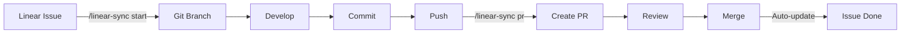

# Linear Setup - Summary & Next Steps

## ✅ What's Been Created

### 1. Complete Linear Import Package
Three files ready for your Linear setup:

#### 📊 `linear-import.csv`
- **12 Epics** covering all major feature areas
- **~80 Stories** with full acceptance criteria
- **Priority levels** (P0/P1/P2) pre-assigned
- **Story point estimates** (1-5 points per story)
- **Labels** for filtering and organization
- **Parent-child relationships** (stories linked to epics)

#### 📖 `LINEAR-EPICS-AND-STORIES.md`
- Full specification document
- Detailed acceptance criteria for each story
- Sprint planning suggestions (10 sprints, ~20 weeks)
- Priority breakdown (P0: 20 stories, P1: 40 stories, P2: 20 stories)
- Story point estimates and recommendations

#### 📘 `LINEAR-IMPORT-GUIDE.md`
- Step-by-step import instructions
- Column mapping guide
- Post-import setup recommendations
- Troubleshooting tips
- Linear workflow integration guide

---

## 🚀 Your Next Steps

### Step 1: Import to Linear (5 minutes)

1. **Open Linear** → Settings → Import → CSV import
2. **Upload file**: `docs/linear-import.csv`
3. **Map columns**:
   - Title → Title
   - Description → Description
   - Priority → Priority (0=Urgent, 1=High, 2=Medium)
   - Labels → Labels
   - Estimate → Estimate
   - Parent → Parent Issue
4. **Select project**: "RunExpression V1" (create if needed)
5. **Click Import** (takes 1-2 minutes)

### Step 2: Configure Linear MCP (Optional, 10 minutes)

While you have that in progress, finish configuring Linear MCP:

```bash
# Set your Linear API key (get from Linear Settings → API)
export LINEAR_API_KEY=lin_api_xxxxxxxxxxxx

# Or add to your .env.local (already gitignored)
echo "LINEAR_API_KEY=lin_api_xxxxxxxxxxxx" >> .env.local
```

Then you'll be able to use:
```bash
/linear-sync start RUN-123  # Start work on an issue
/linear-sync pr             # Create PR linked to issue
/linear-sync status         # Check issue status
```

### Step 3: Set Up Linear Views (3 minutes)

Create these helpful views in Linear:

**View 1: By Epic**
- Group by: Parent issue
- Sort by: Priority
- Purpose: See all work organized by feature

**View 2: P0 Critical**
- Filter: Priority = Urgent
- Sort by: Estimate
- Purpose: See must-have features for launch

**View 3: Current Sprint**
- Filter: Status = In Progress OR In Review
- Sort by: Updated (desc)
- Purpose: Daily standup view

### Step 4: Create Your First Sprint (5 minutes)

Suggested Sprint 1 (2 weeks):

**From Foundation & Infrastructure Epic:**
- [ ] Project Setup & Configuration (2 pts)
- [ ] Supabase Project Setup (3 pts)
- [ ] Design System & Theme Configuration (3 pts)
- [ ] Core Database Schema Migration (5 pts)
- [ ] Middleware & Route Protection (2 pts)

**Total: 15 story points** (good for a 2-week sprint)

### Step 5: Start Development (Now!)

```bash
# Pick your first issue from Sprint 1
/linear-sync start RUN-XXX

# Start building
npm run dev
```

---

## 📊 Project Overview

### Total Scope
- **12 Epics** (major feature areas)
- **~80 Stories** (individual tasks)
- **~20 weeks** (10 two-week sprints)
- **~150-200 story points** total

### Priority Breakdown

| Priority | Count | Description | Timeline |
|----------|-------|-------------|----------|
| P0 (Critical) | ~20 stories | Must-have for V1 launch | Sprint 1-6 |
| P1 (High) | ~40 stories | Core features | Sprint 1-8 |
| P2 (Medium) | ~20 stories | Enhanced features | Sprint 8-10 |

### Epic Breakdown

| Epic | Stories | Points | Sprint |
|------|---------|--------|--------|
| Foundation & Infrastructure | 5 | 15 | 1-2 |
| Homepage & Manifesto | 9 | 20 | 2-3 |
| The Flow (Canvas) | 9 | 26 | 3-5 |
| DWTC Clubhouse | 12 | 30 | 5-7 |
| Authentication | 6 | 14 | 4-5 |
| Content Moderation | 4 | 13 | 5-6 |
| Shop & Commerce | 7 | 18 | 7-8 |
| AI Coach Hooks | 7 | 12 | 8-9 |
| Blog & Content | 4 | 10 | 9 |
| Testing & QA | 6 | 18 | 9-10 |
| DevOps | 7 | 17 | 1-10 (ongoing) |
| Content & Brand | 4 | 13 | 9-10 |

---

## 🎯 Success Metrics

After import, you should have:
- ✅ 12 epic issues created
- ✅ ~80 child issues under epics
- ✅ All issues have acceptance criteria
- ✅ All issues have story point estimates
- ✅ All issues have priority levels
- ✅ All issues have relevant labels

---

## 🔄 Workflow Integration

### With Git (after Linear MCP setup)



### Daily Workflow

```bash
# Morning: Check your sprint
# Open Linear → Current Sprint view

# Pick an issue
/linear-sync start RUN-123

# Develop
npm run dev
# ... make changes ...
git add .
git commit -m "feat(flow): Add vibe tag filtering for RUN-123"
git push

# Create PR
/linear-sync pr

# Continue with next issue
```

---

## 📚 Reference Documents

| Document | Purpose | Location |
|----------|---------|----------|
| This file | Setup summary | `docs/LINEAR-SETUP-SUMMARY.md` |
| Import CSV | Linear import file | `docs/linear-import.csv` |
| Import Guide | Import instructions | `docs/LINEAR-IMPORT-GUIDE.md` |
| Full Spec | Complete story details | `docs/LINEAR-EPICS-AND-STORIES.md` |
| Tech Specs | Technical requirements | `docs/specs/` |

---

## ⚡ Quick Start Checklist

Copy this to get started:

```markdown
## Linear Setup Checklist

- [ ] Import CSV to Linear (docs/linear-import.csv)
- [ ] Verify all 12 epics created
- [ ] Verify ~80 stories imported
- [ ] Set up Linear views (By Epic, P0 Critical, Current Sprint)
- [ ] Create Sprint 1 with Foundation stories
- [ ] Configure Linear MCP (set LINEAR_API_KEY)
- [ ] Test linear-sync commands
- [ ] Assign Sprint 1 stories to team
- [ ] Start first issue: Project Setup & Configuration
- [ ] Begin development!
```

---

## 🆘 Need Help?

### Common Issues

**Q: CSV import failed**
- Check file encoding (UTF-8)
- Try importing epics first, then stories
- See troubleshooting in LINEAR-IMPORT-GUIDE.md

**Q: Parent relationships not working**
- Import epics first
- Then import stories with Parent column
- Or manually link after import

**Q: Story points not showing**
- Enable Estimates in Team Settings
- Verify team scale matches (1-5 points)

**Q: Linear MCP not working**
- Check LINEAR_API_KEY is set
- Verify API key has correct permissions
- Test with: `/linear-sync status`

### Resources

- Linear Import Docs: https://linear.app/docs/import
- Linear API: https://developers.linear.app/
- MCP Setup: Check `.cursor/skills/linear-sync/SKILL.md`

---

## 🎉 You're Ready!

All your Linear stories are packaged and ready to import. This represents the complete V1 scope from all the specs in `docs/specs/`.

**Total estimated time: 20 weeks (10 sprints) with proper resourcing**

Import the CSV and start building! 🚀
